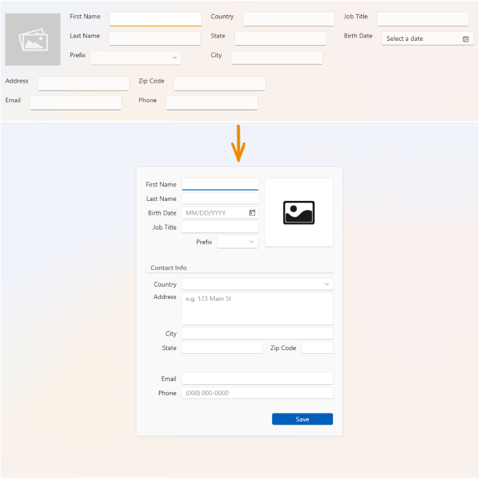

# Desktop Edit Forms - UX Best Practices

This example demonstrates five main UX principles of edit forms:

1. Cohesion  
2. Simplicity  
3. Logic  
4. Focus (user attention)  
5. Assistance

By appling these principles, an edit form in the project is transformed in the following manner:

For more information, refer to my YouTube video: [Secrets of Edit Forms: Best Practices, Mistakes and AI](https://www.youtube.com/watch?v=4e74iloPnyk)

> [!Note]  
> This example uses DevExpress WPF controls. To run it, you need to register a [DevExpress NuGet feed](https://nuget.devexpress.com/). If you want to run only the part with standard WPF controls, comment out the DevExpress components in XAML and remove the NuGet package references. The AI Smart Past feature is currently available in the EAP release.

